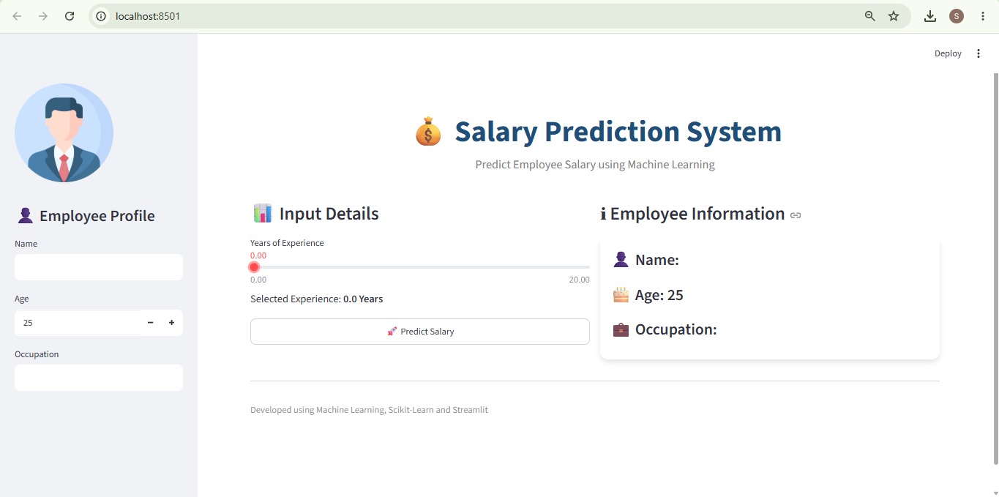
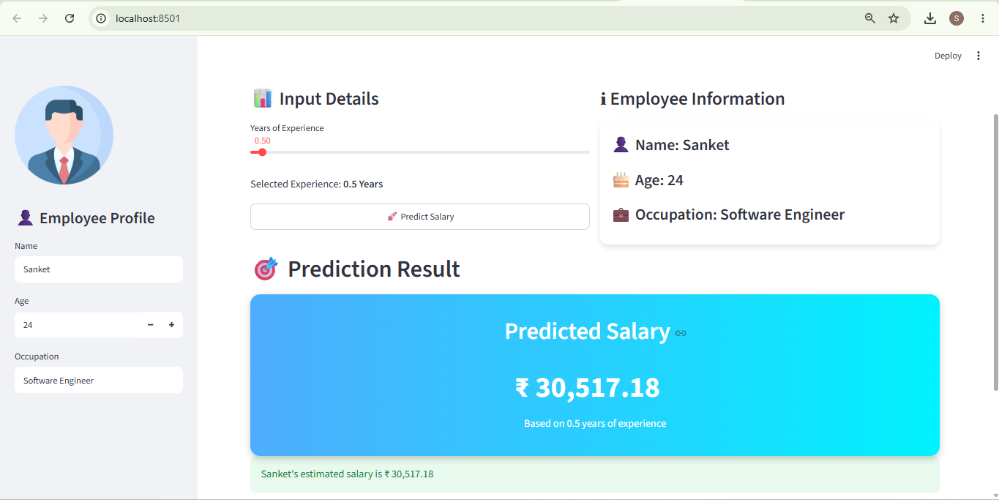
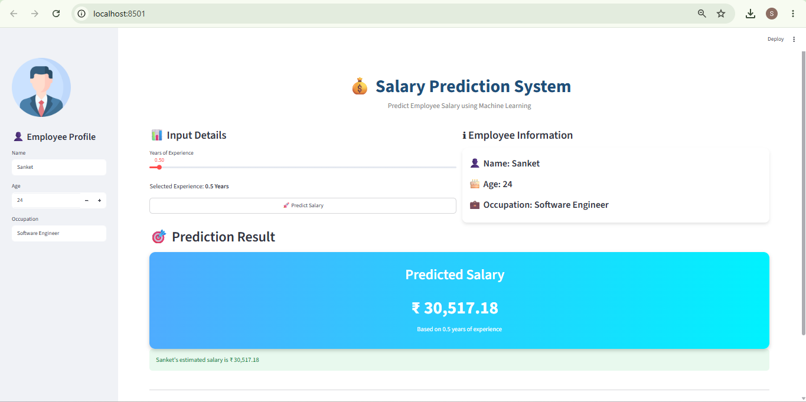

# 💰 Salary Prediction System

A Machine Learning web application built using Streamlit that predicts employee salary based on years of experience. The application provides a simple and interactive user interface where users can enter their details and instantly receive a salary prediction generated by a trained Machine Learning model.

---

## 📌 Project Overview

Salary estimation is a common business problem that helps organizations and job seekers understand compensation trends. This project uses a Machine Learning Regression model trained on historical salary data to predict an employee's salary based on years of experience.

The trained model is saved using Pickle (`salary_pred1.pkl`) and deployed through a Streamlit web application for real-time predictions.

---

## 🚀 Features

* Interactive and user-friendly Streamlit interface
* Real-time salary prediction
* Machine Learning based prediction engine
* Clean and professional dashboard
* Employee information collection
* Fast prediction using a pre-trained model
* Easy deployment and execution

---

## 🛠️ Technologies Used

### Programming Language

* Python

### Machine Learning

* Scikit-Learn

### Data Processing

* NumPy
* Pandas

### Deployment & UI

* Streamlit

### Model Serialization

* Pickle

### Version Control

* Git
* GitHub

---

## 📂 Project Structure

```text
Salary-Prediction-System/
│
├── app.py
├── salary_pred.pkl
├── requirements.txt
├── README.md
├── screenshots/
│   ├── home.png
│   └── prediction.png
│
└── dataset/
    └── salary_data.csv
```

---

## ⚙️ How It Works

1. User enters:

   * Name
   * Age
   * Occupation
   * Years of Experience

2. Streamlit collects the input.

3. The trained Machine Learning model is loaded from:

   ```
   salary_pred1.pkl
   ```

4. Years of Experience is passed to the model.

5. The model predicts the expected salary.

6. The predicted salary is displayed on the screen.

---

## 🧠 Machine Learning Workflow

### Data Collection

Salary dataset containing:

* Years of Experience
* Salary

### Data Preprocessing

* Data cleaning
* Feature selection
* Input preparation

### Model Training

A Regression Model is trained using Scikit-Learn.

### Model Evaluation

Model performance is evaluated using standard regression metrics.

### Model Deployment

The trained model is saved using Pickle and integrated with Streamlit.

---

## ▶️ Installation

### Clone Repository

```bash
git clone https://github.com/yourusername/Salary-Prediction-System.git
```

### Navigate to Project Folder

```bash
cd Salary-Prediction-System
```

### Install Dependencies

```bash
pip install -r requirements.txt
```

---

## ▶️ Run Application

```bash
streamlit run app.py
```

After running the command, open:

```text
http://localhost:8501
```

---

## 📸 Application Screenshots

### Home Page



### Prediction Result





---

## 📊 Sample Prediction

| Years of Experience | Predicted Salary |
| ------------------- | ---------------- |
| 1                   | ₹3,50,000        |
| 3                   | ₹5,20,000        |
| 5                   | ₹7,10,000        |
| 8                   | ₹10,20,000       |

*Values are examples and depend on the trained model.*

---

## 🔮 Future Enhancements

* Multiple input features
* Education level prediction
* Location-based salary prediction
* Experience growth visualization
* Salary analytics dashboard
* PDF report generation
* Cloud deployment
* Database integration

---

## 💼 Skills Demonstrated

* Machine Learning
* Data Analysis
* Regression Modeling
* Model Serialization
* Streamlit Development
* Python Programming
* Git & GitHub
* Deployment Concepts

---

## 🎯 Learning Outcomes

Through this project, I learned:

* Building end-to-end ML applications
* Training and deploying ML models
* Creating interactive web applications
* Working with Scikit-Learn
* Using Pickle for model persistence
* Managing projects using Git and GitHub

---

## 👨‍💻 Author

Sanket More
